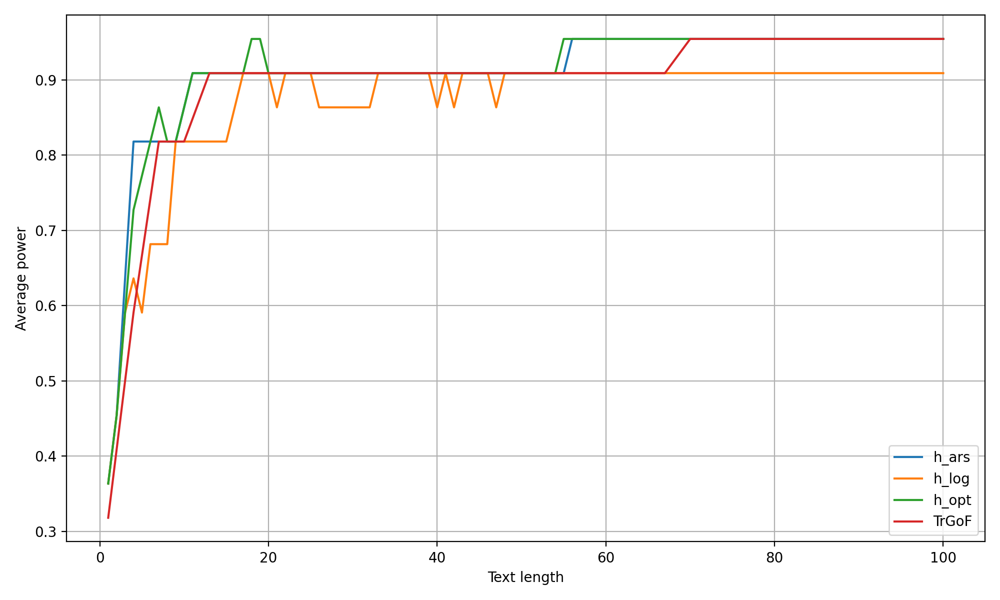

# WatermarkFramework

This repository contains the codes for the paper

> [A Statistical Framework of Watermarks for Large Language Models: Pivot, Detection Efficiency and Optimal Rules](https://arxiv.org/abs/2404.01245)

If you find this code useful in your research, please consider citing:

    @article{li2025statistical,
        title={A statistical framework of watermarks for large language models: {P}ivot, detection efficiency and optimal rules},
        author={Li, Xiang and Ruan, Feng and Wang, Huiyuan and Long, Qi and Su, Weijie J},
        journal={The Annals of Statistics},
        volume={53},
        number={1},
        pages={322--351},
        year={2025},
        publisher={Institute of Mathematical Statistics}
    }
    
## Description of directory layouts
    .
    ├── real data                      # Codes for the language model experiments
    │   ├── generation.py                  # Wrappers used in generating (un)watermarked texts
    │   ├── sampling.py                    # Sampling methods used in the next-token prediction 
    │   ├── alternative_prf_schemes.py     # Various hash (pseudorandom) functions
    │   ├── generating_samples.py          # Formal procedures to generate and save (un)watermarked texts
    │   ├── score_functions.py             # Various score functions
    │   ├── compute_test_scores.py         # Compute and save the detection rule results
    │   ├── results_data                   # Files containing the saved data used in figure plotting
    │   └── plot.py                        # Plot the figure in the experiment section
    └── simulation                      # Codes for the simulation experiments
    │   ├── simulation_max.py              # Simulation codes for the Gumbel-max watermark
    │   ├── simulation_inv.py              # Simulation codes for the inverse transform watermark
    │   ├── results_data                   # Files containing the saved data used in figure plotting
    │   ├── plot_appendix.py               # Plot the figures in the appendix experiment section
    │   └── plot.py                        # Plot the figure in the experiment section
    └── README.md

## A simple watermark demo script

We recently provide an independent script `watermark_demo.py` that demonstrates watermark generation and detection in a self-contained setup. It does not rely on pre-generated files or saved data and is ideal for quick experimentation or understanding the watermarking process.

### What it does:

* Generates watermarked text using **Gumbel-max sampling** from a specified language model.
* Computes **pivotal statistics** for each token.
* Applies several **detection methods**, including:

  * `h_log`
  * `h_ars`
  * `h_opt_gum` (based on a theoretically optimal transformation)
  * `TrGoF` (a robust test proposed in our paper)
* Plots the **detection power** (true positive rate) versus text length.

### How to run:

```bash
python watermark_demo.py --temp 1 --alpha 0.01 --model facebook/opt-1.3b
```

Available options:

* `--temp`: Sampling temperature (default: 1.0)
* `--alpha`: Significance level for detection (default: 0.01)
* `--model`: HuggingFace model name or path (e.g., `facebook/opt-1.3b`, `gpt2`)

The script will automatically:

* Load prompts from the AG News dataset,
* Generate text continuations using the chosen model,
* Perform watermark detection,
* Save the detection power plot.

### Example Output

Below is an example of the detection power curve plot generated by the demo script:

<p align="center">
  
</p>

This figure shows how the detection power increases with text length for different statistical tests, demonstrating the effectiveness of the proposed methods.

## Some notes for real data experiments in our paper

#### 1\. The pipline:

To begin, execute `generating_samples.py`. This script generates and saves texts with and without watermarks based on the specified configuration. 

Next, proceed with `compute_test_scores.py` to calculate and store the detection results for all the score functions being evaluated. 

Finally, use `plot.py` to visualize Type I (or II) errors against text length.

Please ensure that the configuration used is consistent across the first two steps.

#### 2\. How to run the code:

For the first step:

```
python generating_samples.py --method gumbel --model facebook/opt-1.3b --batch_size 8 --c 4 --m 200 --T 500 --seed 15485863
```

Here there are two kinds of watermark methods implemented `gumbel` for the Gumbel-max watermark and `transform` for the inverse transform watermark.
`c` denotes the length of the text window used to compute the hash function.
`m` denotes the maximum length of generated texts and `T` denotes the total number of generations.
`seed` means the used secret key.

For the second step:

```
python compute_test_scores.py --method gumbel --model facebook/opt-1.3b --c 4 --m 200 --T 500 
```

For the last step: simply run (please ensure that the path ot the saved detection results is correct)

```
python plot.py
```

#### 3\. Some limitations:

The implementation of inverse transform watermarks is currently limited to supporting a batch size of 1.
